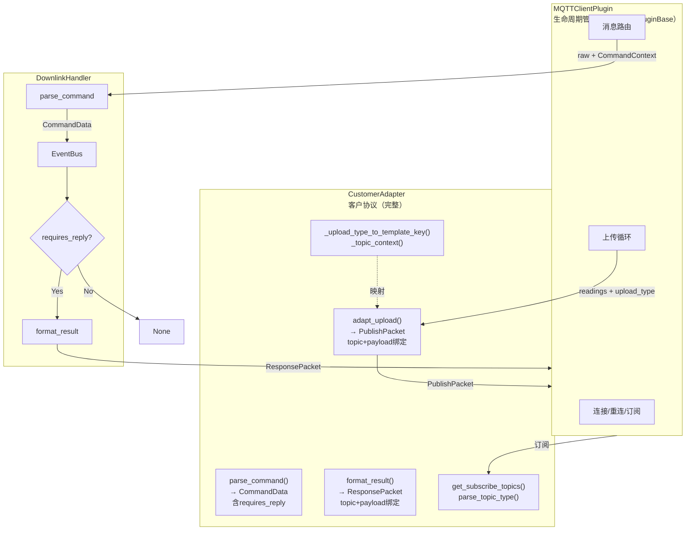

# MQTT模块重构方案（调整版）

## 一、核心设计原则

**适配器 = 客户协议**。数据格式和Topic结构是协议的一体两面，必须内聚，不可拆散。

```
简洁 > 灵活 > 配置驱动
差异由适配器内部消化，Handler 和 Plugin 保持无感知
```

---

## 二、架构总览

### 2.1 架构图



### 2.2 与原方案的核心差异

| 维度 | 原方案 | 调整后 |
|------|--------|--------|
| **拆分依据** | 按技术关注点（DataAdapter + TopicManager） | 按变化方向（客户协议作为整体） |
| **核心抽象** | DataAdapter + TopicManager 两个接口 | 一个 Adapter 代表完整协议 |
| **协调责任** | Plugin 负责协调两个对象 | Adapter 内部闭环，Plugin 零协调 |
| **返回值** | UploadData(payload) + topic 分离 | PublishPacket(topic + payload) 绑定 |
| **上下文传递** | `**kwargs` | `CommandContext` dataclass |
| **下行分发** | DownlinkHandler 硬编码分支 | 适配器内部处理，Handler 只看 requires_reply |
| **扩展层** | TimestampFormatter/DataSerializer/ConfigValidator | 不需要，过度抽象 |

---

## 三、模块结构

```
mqtt_client/
├── __init__.py
├── types.py              # 核心类型（PublishPacket, CommandData, ResponsePacket...）
├── exceptions.py         # 异常层次
├── adapters/
│   ├── __init__.py       # 注册表
│   ├── base.py           # 基类：默认实现 + 配置驱动Topic
│   ├── standard.py       # 标准协议
│   └── customer_a.py     # 客户A协议
├── plugin.py             # MQTT生命周期（继承NorthPluginBase）
├── downlink.py           # 下行命令处理流程
└── constants.py          # 常量
```

与原方案对比：**没有 `topic_manager/` 目录，没有 `interfaces.py`**。Topic管理是适配器的内部职责，不是独立模块。

---

## 四、核心类型定义

```python
# types.py

from dataclasses import dataclass, field
from typing import Any, Dict, List, Optional


@dataclass
class PublishPacket:
    """发布包 - 自包含的发布单元

    关键设计：topic 和 payload 绑定在一起，
    调用方不需要知道"这个数据该发到哪个topic"，
    消除数据与topic错配的可能性。
    """
    topic: str
    payload: Dict[str, Any]


@dataclass
class CommandData:
    """解析后的命令

    requires_reply: 由适配器根据协议决定是否需要回复。
    例如 property_down 需要回复，connect_reply 不需要。
    """
    asset: str
    data: Dict[str, Any]
    command_type: str = "write_property"  # write_property / device_status
    requires_reply: bool = True


@dataclass
class ResponsePacket:
    """响应包 - 自包含的响应单元

    topic 和 payload 绑定，与 PublishPacket 同理。
    """
    topic: str
    payload: Dict[str, Any]


@dataclass
class CommandResult:
    """命令执行结果（框架产生，适配器消费）"""
    success: bool
    asset: Optional[str] = None
    data: Optional[Dict[str, Any]] = None
    error: Optional[str] = None


@dataclass
class CommandContext:
    """命令上下文（适配器格式化响应时需要的额外信息）

    替代 **kwargs，提供类型安全的上下文传递。
    """
    raw_command: Dict[str, Any]
    topic: str
    topic_type: str
```

### 类型设计要点

| 类型 | 职责 | 设计意图 |
|------|------|---------|
| `PublishPacket` | 上行发布单元 | topic+payload绑定，不可能错配 |
| `ResponsePacket` | 下行响应单元 | topic+payload绑定，不可能错配 |
| `CommandData` | 解析后的命令 | requires_reply标志，适配器决定是否需要回复 |
| `CommandContext` | 下行上下文 | 替代**kwargs，类型安全 |
| `CommandResult` | 执行结果 | 框架产生，适配器消费 |

---

## 五、异常定义

```python
# exceptions.py

class MQTTAdapterError(Exception):
    """MQTT适配器基础异常"""
    pass


class DataConversionError(MQTTAdapterError):
    """数据转换错误"""
    pass


class TopicError(MQTTAdapterError):
    """Topic错误"""
    pass


class CommandTimeoutError(MQTTAdapterError):
    """命令超时错误"""
    pass


class ConfigError(MQTTAdapterError):
    """配置错误"""
    pass
```

---

## 六、适配器接口

### 6.1 基类设计

```python
# adapters/base.py

import logging
from typing import Any, Dict, List, Optional

from xagent.xcore.storage.interface import Reading
from ..types import (
    PublishPacket, CommandData, CommandResult,
    ResponsePacket, CommandContext,
)
from ..exceptions import DataConversionError, TopicError

logger = logging.getLogger(__name__)


class BaseAdapter:
    """客户协议基类

    适配器 = 客户的完整MQTT协议
    数据格式 + Topic结构 + 消息流程 作为一个整体

    设计要点：
    - adapt_upload 返回 PublishPacket，topic和payload绑定
    - format_result 返回 ResponsePacket，topic和payload绑定
    - parse_command 返回 CommandData，含 requires_reply 标志
    - Topic管理是内部职责，通过 private 方法暴露
    """

    def __init__(self, config: Dict[str, Any]):
        self._config = config

    # ===== 上行：一步到位 =====

    def adapt_upload(self, readings: List[Reading]) -> List[PublishPacket]:
        """转换上行数据 → 返回发布包列表

        适配器内部通过 _infer_upload_type 推断每条 reading 的上行类型，
        按类型分组后生成对应的 PublishPacket。

        调用方只需遍历列表：for packet in packets: client.publish(...)
        不需要知道 upload_type，不需要关心 topic。

        Args:
            readings: 数据列表

        Returns:
            List[PublishPacket]: 发布包列表，每个包的 topic+payload 已绑定
        """
        if not readings:
            raise DataConversionError("readings cannot be empty")

        try:
            # 按 upload_type 分组
            groups: Dict[str, List[Reading]] = {}
            for reading in readings:
                upload_type = self._infer_upload_type(reading)
                groups.setdefault(upload_type, []).append(reading)

            # 每组生成一个 PublishPacket
            packets = []
            for upload_type, group_readings in groups.items():
                payload = self._build_upload_payload(group_readings, upload_type)
                topic = self._get_publish_topic(upload_type)
                packets.append(PublishPacket(topic=topic, payload=payload))

            return packets
        except MQTTAdapterError:
            raise
        except Exception as e:
            logger.error(f"adapt_upload error: {e}")
            raise DataConversionError(f"Failed to adapt upload data: {e}") from e

    def _infer_upload_type(self, reading: Reading) -> str:
        """推断单条reading的上行类型 - 子类可覆盖

        默认实现：始终返回 "property"
        客户A覆盖：根据 reading.device_status 推断 connect/disconnect

        注意：参数是单条 Reading，不是 List，因为每条 reading 可能属于不同类型
        """
        return "property"

    def _build_upload_payload(
        self, readings: List[Reading], upload_type: str
    ) -> Dict[str, Any]:
        """构建上行payload - 子类覆盖以实现客户特定格式"""
        if len(readings) == 1:
            return self._build_single_reading_payload(readings[0], upload_type)
        return {
            "count": len(readings),
            "readings": [
                self._build_single_reading_payload(r, upload_type) for r in readings
            ],
            "timestamp": readings[0].timestamp,
        }

    def _build_single_reading_payload(
        self, reading: Reading, upload_type: str
    ) -> Dict[str, Any]:
        """单条数据payload - 子类可覆盖"""
        return {
            "asset": reading.asset,
            "timestamp": reading.timestamp,
            "data": reading.data,
        }

    def _get_publish_topic(self, upload_type: str) -> str:
        """获取发布topic - 配置驱动 + 子类可覆盖

        通过 _upload_type_to_template_key 将 upload_type 映射到模板key，
        再从 topic_templates 配置中查找模板并格式化。
        """
        templates = self._config.get("topic_templates", {})
        template_key = self._upload_type_to_template_key(upload_type)
        template = templates.get(template_key, "")

        if not template:
            raise TopicError(
                f"No topic template for upload_type '{upload_type}' "
                f"(mapped key: '{template_key}')"
            )

        try:
            return template.format(**self._topic_context(upload_type))
        except KeyError as e:
            raise TopicError(
                f"Topic template '{template_key}' has missing placeholder: {e}"
            ) from e

    def _upload_type_to_template_key(self, upload_type: str) -> str:
        """upload_type → 模板key的映射，支持配置驱动

        优先从 upload_type_map 配置读取映射，
        未配置时默认：property → property_up, connect → connect_up
        不同客户的模板key命名不同，可通过配置或子类覆盖解决。
        """
        mapping = self._config.get("upload_type_map", {})
        return mapping.get(upload_type, f"{upload_type}_up")

    def _topic_context(self, upload_type: str) -> Dict[str, str]:
        """生成topic模板的填充上下文

        默认使用适配器配置填充，子类可覆盖以添加运行时变量。
        """
        return dict(self._config)

    # ===== 下行：解析 + 响应 =====

    def parse_command(self, raw: Dict[str, Any], context: CommandContext) -> CommandData:
        """解析下行命令

        Args:
            raw: 原始命令数据
            context: 命令上下文（含topic、topic_type等）

        Returns:
            CommandData: 解析后的命令，requires_reply由适配器根据协议决定
        """
        if not raw:
            raise DataConversionError("raw command cannot be empty")

        return CommandData(
            asset=raw.get("asset", ""),
            data=raw.get("data", {}),
        )

    def format_result(
        self, result: CommandResult, context: CommandContext
    ) -> ResponsePacket:
        """格式化命令结果 → 返回完整的响应包

        调用方只需要：client.publish(packet.topic, packet.payload)
        不需要再问"响应该发到哪个topic"

        Args:
            result: 命令执行结果
            context: 命令上下文

        Returns:
            ResponsePacket: 自包含的响应单元
        """
        payload = self._build_response_payload(result, context)
        topic = self._get_reply_topic(context.topic)
        return ResponsePacket(topic=topic, payload=payload)

    def _build_response_payload(
        self, result: CommandResult, context: CommandContext
    ) -> Dict[str, Any]:
        """构建响应payload - 子类覆盖以实现客户特定格式"""
        payload = {"timestamp": __import__("time").time()}

        if result.success:
            payload["status"] = "success"
            if result.asset:
                payload["asset"] = result.asset
            if result.data:
                payload["data"] = result.data
        else:
            payload["status"] = "error"
            if result.error:
                payload["error"] = result.error

        return payload

    def _get_reply_topic(self, command_topic: str) -> str:
        """获取回复topic - 子类覆盖或配置驱动"""
        rule = self._config.get("reply_topic_rule", "suffix_result")
        if rule == "suffix_reply":
            return command_topic + "_reply"
        elif rule == "suffix_result":
            return f"{command_topic}/result"
        elif rule == "replace_down_with_reply":
            return command_topic.replace("/down", "/reply")
        raise TopicError(f"Unknown reply_topic_rule: {rule}")

    # ===== Topic管理 =====

    def get_subscribe_topics(self) -> List[str]:
        """获取需要订阅的Topic列表 - 配置驱动"""
        templates = self._config.get("topic_templates", {})
        subscribe_types = self._config.get("subscribe_types", [])

        topics = []
        for topic_type in subscribe_types:
            if topic_type in templates:
                try:
                    topic = templates[topic_type].format(**self._config)
                    topics.append(topic)
                except KeyError as e:
                    logger.warning(
                        f"Topic template '{topic_type}' has missing placeholder: {e}"
                    )
            else:
                logger.warning(f"Topic type '{topic_type}' not found in templates")

        return topics

    def parse_topic_type(self, topic: str) -> str:
        """解析Topic类型 - 配置驱动"""
        rules = self._config.get("topic_type_rules", {})
        for pattern, topic_type in rules.items():
            if pattern in topic:
                return topic_type
        return "unknown"

    # ===== 工具方法 =====

    def to_json(self, payload: Any) -> str:
        """序列化为JSON字符串"""
        import json
        return json.dumps(payload, ensure_ascii=False)
```

### 6.2 接口方法一览

| 方法 | 可见性 | 返回类型 | 说明 |
|------|--------|---------|------|
| `adapt_upload` | public | `PublishPacket` | 上行数据转换，一步到位 |
| `parse_command` | public | `CommandData` | 下行命令解析，含requires_reply |
| `format_result` | public | `ResponsePacket` | 结果格式化，一步到位 |
| `get_subscribe_topics` | public | `List[str]` | 获取订阅列表 |
| `parse_topic_type` | public | `str` | 解析topic类型 |
| `to_json` | public | `str` | JSON序列化 |
| `_build_upload_payload` | protected | `Dict` | 构建上行payload，子类覆盖点 |
| `_upload_type_to_template_key` | protected | `str` | upload_type映射，子类覆盖点 |
| `_topic_context` | protected | `Dict` | topic模板上下文，子类覆盖点 |
| `_build_response_payload` | protected | `Dict` | 构建响应payload，子类覆盖点 |
| `_get_reply_topic` | protected | `str` | 回复topic生成，子类覆盖点 |
| `_get_publish_topic` | protected | `str` | 发布topic生成，内部调用 |

**设计意图**：公开方法返回自包含的 Packet 对象，protected 方法是子类的覆盖点。子类只需覆盖必要的 protected 方法，不需要关心公开方法的组装逻辑。

---

## 七、客户A适配器实现

```python
# adapters/customer_a.py

import logging
from typing import Any, Dict, List, Optional

from xagent.xcore.storage.interface import Reading
from ..types import (
    PublishPacket, CommandData, CommandResult,
    ResponsePacket, CommandContext,
)
from ..exceptions import DataConversionError
from .base import BaseAdapter
from . import register

logger = logging.getLogger(__name__)


@register("customer_a")
class CustomerAAdapter(BaseAdapter):
    """客户A协议 - 数据格式与Topic结构作为整体

    协议特点：
    - 上行：{msgid, params: {point: {value, ts}}} 或 {msgid, params: {productKey, deviceSN}}
    - 下行：{msgid, params: {point: value}} → 解析为 CommandData
    - 回复：{msgid, code: 0/−1, data: {}}
    - Topic：$v1/{productKey}/{deviceSN}/sys/...
    """

    MSGID_MAX = 4294967295

    def __init__(self, config: Dict[str, Any]):
        super().__init__(config)
        self._msgid_counter = 0

    def _generate_msgid(self) -> str:
        """生成消息ID - 递增计数器"""
        self._msgid_counter = (self._msgid_counter + 1) % (self.MSGID_MAX + 1)
        return str(self._msgid_counter)

    # ===== upload_type映射 =====

    def _upload_type_to_template_key(self, upload_type: str) -> str:
        """客户A的模板key映射

        property → property_up
        connect → connect
        disconnect → disconnect
        """
        if upload_type == "property":
            return "property_up"
        return upload_type

    # ===== 上行 =====

    def _build_upload_payload(
        self, readings: List[Reading], upload_type: str
    ) -> Dict[str, Any]:
        """客户A上行数据转换

        根据 upload_type 识别场景：
        - property: 普通数据上报
        - connect: 设备上线
        - disconnect: 设备下线
        """
        if upload_type == "connect":
            return self._build_connect_payload(readings[0])
        elif upload_type == "disconnect":
            return self._build_disconnect_payload(readings[0])
        else:
            return self._build_property_payload(readings)

    def _build_property_payload(self, readings: List[Reading]) -> Dict[str, Any]:
        """普通数据上报: {msgid, params: {point: {value, ts}}}"""
        params = {}
        for reading in readings:
            for key, value in reading.data.items():
                params[key] = {
                    "value": value,
                    "ts": int(reading.timestamp * 1000),
                }
        return {"msgid": self._generate_msgid(), "params": params}

    def _build_connect_payload(self, reading: Reading) -> Dict[str, Any]:
        """设备上线: {msgid, params: {productKey, deviceSN}}"""
        return {
            "msgid": self._generate_msgid(),
            "params": {
                "productKey": self._config.get("productKey", ""),
                "deviceSN": reading.asset,
            },
        }

    def _build_disconnect_payload(self, reading: Reading) -> Dict[str, Any]:
        """设备下线: {msgid, params: {productKey, deviceSN}}"""
        return {
            "msgid": self._generate_msgid(),
            "params": {
                "productKey": self._config.get("productKey", ""),
                "deviceSN": reading.asset,
            },
        }

    # ===== 下行 =====

    def parse_command(self, raw: Dict[str, Any], context: CommandContext) -> CommandData:
        """客户A下行命令解析

        根据 topic_type 判断命令类型：
        - property_down: 设置属性，需要回复
        - connect_reply / disconnect_reply: 上线/下线回复，不需要回复
        """
        if context.topic_type == "property_down":
            return CommandData(
                asset="",
                data=raw.get("params", {}),
                command_type="write_property",
                requires_reply=True,
            )
        elif context.topic_type in ("connect_reply", "disconnect_reply"):
            return CommandData(
                asset=raw.get("data", {}).get("deviceSN", ""),
                data=raw.get("data", {}),
                command_type="device_status",
                requires_reply=False,  # 协议决定：不需要回复
            )
        return CommandData(asset="", data=raw, requires_reply=True)

    def _build_response_payload(
        self, result: CommandResult, context: CommandContext
    ) -> Dict[str, Any]:
        """客户A回复格式: {msgid, code, data/message}"""
        msgid = context.raw_command.get("msgid", "0")

        if context.topic_type == "property_down":
            return {
                "msgid": msgid,
                "code": 0 if result.success else -1,
                "data": {},
            }
        return {
            "msgid": msgid,
            "code": 0 if result.success else -1,
            "message": "success" if result.success else (result.error or "error"),
        }
```

---

## 八、Plugin实现

```python
# plugin.py（关键方法）

class MQTTClientPlugin(NorthPluginBase):
    """MQTT客户端插件 - 只负责生命周期管理

    设计要点：
    - 继承 NorthPluginBase，复用框架能力
    - 所有客户相关逻辑委托给适配器
    - Plugin 零协调，零客户特定代码
    """

    def _create_data_adapter(self) -> Any:
        """创建数据适配器 - 使用注册表"""
        from .adapters import get_adapter

        adapter_name = self.config.get("adapter", "standard")
        adapter_config = self.config.get("adapter_config", {})

        try:
            return get_adapter(adapter_name, adapter_config)
        except ValueError as e:
            logger.warning(f"{e}. Falling back to standard adapter")
            return get_adapter("standard", adapter_config)

    # ===== 上行 =====

    async def _send_single(self, readings: List[Reading]) -> int:
        """逐条发送 - 一步到位，不需要协调"""
        sent = 0
        for reading in readings:
            try:
                packet = self._data_adapter.adapt_upload(
                    [reading], upload_type="property"
                )
                payload_str = self._data_adapter.to_json(packet.payload)
                await self._client.publish(
                    topic=packet.topic, payload=payload_str, qos=self._qos
                )
                sent += 1
            except MQTTAdapterError as e:
                logger.error(f"Error sending reading: {e}")
            except Exception as e:
                if self._is_connection_error(e):
                    self._connected = False
                    break
                logger.error(f"Error sending reading: {e}")
        return sent

    # ===== 下行 =====

    async def _handle_mqtt_message(self, message) -> None:
        """处理MQTT消息 - 委托给DownlinkHandler"""
        topic = str(message.topic)
        raw = json.loads(message.payload.decode("utf-8"))

        # 构建上下文
        context = CommandContext(
            raw_command=raw,
            topic=topic,
            topic_type=self._data_adapter.parse_topic_type(topic),
        )

        # 委托Handler处理
        response = await self._downlink_handler.handle(raw, context)

        # 发布响应（如果有）
        if response:
            payload_str = self._data_adapter.to_json(response.payload)
            await self._client.publish(
                topic=response.topic, payload=payload_str, qos=self._qos
            )

    # ===== 订阅 =====

    async def _do_subscribe(self) -> None:
        """订阅 - 从适配器获取订阅列表"""
        topics = self._data_adapter.get_subscribe_topics()
        for topic in topics:
            await self._client.subscribe(topic, qos=self._qos)
            logger.info(f"Subscribed to topic: {topic}")
```

---

## 九、DownlinkHandler实现

```python
# downlink.py

import asyncio
import logging
from typing import Optional

from xagent.xcore.core.event_bus import EventBus, Event, EventType
from .types import CommandContext, CommandResult, ResponsePacket
from .exceptions import CommandTimeoutError, MQTTAdapterError

logger = logging.getLogger(__name__)


class DownlinkHandler:
    """下行消息处理器 - 只负责命令执行流程

    设计要点：
    - 不包含任何客户特定逻辑
    - 通过 requires_reply 标志决定是否回复
    - 不需要知道 topic_type 的具体含义
    """

    def __init__(
        self,
        event_bus: EventBus,
        adapter: Any,
        timeout: float = 30.0,
    ):
        self._event_bus = event_bus
        self._adapter = adapter
        self._timeout = timeout

    async def handle(
        self,
        raw: dict,
        context: CommandContext,
    ) -> Optional[ResponsePacket]:
        """处理下行消息

        Returns:
            ResponsePacket: 需要回复时返回
            None: 不需要回复时返回（如connect_reply）
        """
        try:
            # 1. 解析命令（适配器根据topic_type内部处理差异）
            command = self._adapter.parse_command(raw, context)

            # 2. 始终发布事件（无论是否需要回复）
            await self._event_bus.publish(
                Event(
                    event_type=EventType.COMMAND_RECEIVED,
                    data={
                        "asset": command.asset,
                        "data": command.data,
                        "command_type": command.command_type,
                    },
                )
            )

            # 3. 不需要回复的命令（如connect_reply），到此结束
            if not command.requires_reply:
                logger.info(
                    f"Command processed (no reply required): "
                    f"type={command.command_type}, asset={command.asset}"
                )
                return None

            # 4. 需要回复的命令，等待执行结果
            result = await self._wait_for_result()

            # 5. 格式化响应（适配器内部决定reply topic和payload格式）
            return self._adapter.format_result(result, context)

        except asyncio.TimeoutError:
            logger.error(f"Command timeout after {self._timeout}s")
            raise CommandTimeoutError(
                f"Command timeout after {self._timeout}s"
            )
        except MQTTAdapterError:
            raise
        except Exception as e:
            logger.error(f"Unexpected error: {e}")
            raise MQTTAdapterError(f"Unexpected error: {e}") from e

    async def _wait_for_result(self) -> CommandResult:
        """等待命令执行结果"""
        # 简化实现，实际应等待事件总线返回结果
        await asyncio.sleep(0.1)
        return CommandResult(success=True)
```

---

## 十、配置示例

### 10.1 客户A配置

```yaml
mqtt:
  broker: 192.168.1.100
  port: 1883
  username: user
  password: pass

  adapter: customer_a
  adapter_config:
    # 基础配置
    productKey: al12345****
    deviceSN: device1234

    # Topic模板（协议的一部分）
    topic_templates:
      property_up: "$v1/{productKey}/{deviceSN}/sys/property/up"
      property_down: "$v1/{productKey}/{deviceSN}/sys/property/down"
      connect: "$v1/{productKey}/{deviceSN}/sys/subdevice/connect"
      connect_reply: "$v1/{productKey}/{deviceSN}/sys/subdevice/connect_reply"
      disconnect: "$v1/{productKey}/{deviceSN}/sys/subdevice/disconnect"
      disconnect_reply: "$v1/{productKey}/{deviceSN}/sys/subdevice/disconnect_reply"

    # 订阅类型
    subscribe_types:
      - property_down
      - connect_reply
      - disconnect_reply

    # Topic类型解析规则
    topic_type_rules:
      "/sys/property/down": property_down
      "/sys/subdevice/connect_reply": connect_reply
      "/sys/subdevice/disconnect_reply": disconnect_reply

    # upload_type到模板key的映射
    upload_type_map:
      property: property_up
      connect: connect
      disconnect: disconnect

    # 回复topic规则
    reply_topic_rule: suffix_reply

  command_timeout: 30.0
```

### 10.2 客户B配置

```yaml
mqtt:
  broker: 192.168.1.100
  port: 1883

  adapter: customer_b
  adapter_config:
    deviceSN: device1234

    # Topic模板 - 完全不同的格式
    topic_templates:
      data: "device/{deviceSN}/data"
      command: "device/{deviceSN}/command"
      response: "device/{deviceSN}/response"

    # upload_type映射
    upload_type_map:
      property: data

    # 订阅类型
    subscribe_types:
      - command

    # Topic类型解析规则
    topic_type_rules:
      "/command": command

    # 回复topic规则
    reply_topic_rule: suffix_result
```

### 10.3 客户C配置

```yaml
mqtt:
  broker: 192.168.1.100
  port: 1883

  adapter: customer_c
  adapter_config:
    siteId: factory-01
    deviceId: sensor-001

    # Topic模板 - 极简格式
    topic_templates:
      telemetry: "site/{siteId}/device/{deviceId}/telemetry"
      cmd: "site/{siteId}/device/{deviceId}/cmd"
      result: "site/{siteId}/device/{deviceId}/result"

    # upload_type映射
    upload_type_map:
      property: telemetry

    # 订阅类型
    subscribe_types:
      - cmd

    # Topic类型解析规则
    topic_type_rules:
      "/cmd": cmd

    # 回复topic规则
    reply_topic_rule: suffix_result
```

---

## 十一、场景走查

### 11.1 客户A：普通数据上报

```
readings=[Reading(asset="sensor_01", data={"Temp": 37.0})]
    │
    ▼ adapt_upload(readings)
    │
    ├─ _infer_upload_type(reading) → "property" (device_status为None)
    ├─ 分组: {"property": [reading]}
    ├─ _build_upload_payload → {msgid: "1", params: {Temp: {value: 37.0, ts: 123000}}}
    ├─ _get_publish_topic("property") → "$v1/al12345/sensor_01/sys/property/up"
    │
    ▼ [PublishPacket(topic=".../property/up", payload={msgid, params})]
    │
    ▼ for packet in packets: client.publish(packet.topic, json.dumps(packet.payload))
```

### 11.2 客户A：设备上线

```
readings=[Reading(asset="sub_dev_01", device_status="online")]
    │
    ▼ adapt_upload(readings)
    │
    ├─ _infer_upload_type(reading) → "connect" (device_status=="online")
    ├─ 分组: {"connect": [reading]}
    ├─ _build_upload_payload → {msgid: "2", params: {productKey: "al12345", deviceSN: "sub_dev_01"}}
    ├─ _get_publish_topic("connect") → "$v1/al12345/gateway01/sys/subdevice/connect"
    │
    ▼ [PublishPacket(topic=".../connect", payload={msgid, params})]
```

### 11.2a 客户A：批量混合类型（新增场景）

```
readings=[
    Reading(asset="sensor_01", data={"Temp": 37.0}),
    Reading(asset="sub_dev_01", device_status="online"),
    Reading(asset="sub_dev_02", device_status="offline"),
    Reading(asset="sensor_02", data={"Humidity": 65.0}),
]
    │
    ▼ adapt_upload(readings)
    │
    ├─ 逐条推断 _infer_upload_type:
    │   sensor_01 → "property"
    │   sub_dev_01 → "connect"
    │   sub_dev_02 → "disconnect"
    │   sensor_02 → "property"
    │
    ├─ 分组: {"property": [sensor_01, sensor_02], "connect": [sub_dev_01], "disconnect": [sub_dev_02]}
    │
    ├─ property组 → PublishPacket(topic=".../property/up", payload={msgid, params: {Temp, Humidity}})
    ├─ connect组 → PublishPacket(topic=".../connect", payload={msgid, params: {productKey, deviceSN: sub_dev_01}})
    ├─ disconnect组 → PublishPacket(topic=".../disconnect", payload={msgid, params: {productKey, deviceSN: sub_dev_02}})
    │
    ▼ [PublishPacket×3] → 逐个发布 ✅
```

### 11.3 客户A：设置属性（property_down）

```
收到消息: topic=".../property/down", payload={msgid:"99", params:{Temp:"37.0"}}
    │
    ├─ parse_topic_type → "property_down"
    ├─ CommandContext(raw_command=raw, topic=topic, topic_type="property_down")
    ├─ parse_command → CommandData(asset="", data={Temp:"37.0"}, requires_reply=True)
    ├─ EventBus 发布 COMMAND_RECEIVED ✅
    ├─ requires_reply=True → 等待执行结果
    ├─ format_result → ResponsePacket
    │   ├─ _build_response_payload → {msgid:"99", code:0, data:{}}
    │   └─ _get_reply_topic → suffix_reply → ".../property/down_reply"
    │
    ▼ ResponsePacket(topic=".../down_reply", payload={msgid:"99", code:0, data:{}})
```

### 11.4 客户A：设备上线回复（connect_reply）

```
收到消息: topic=".../connect_reply", payload={msgid:"2", code:0, data:{productKey:..., deviceSN:...}}
    │
    ├─ parse_topic_type → "connect_reply"
    ├─ CommandContext(raw_command=raw, topic=topic, topic_type="connect_reply")
    ├─ parse_command → CommandData(asset="sub_dev_01", data={...}, requires_reply=False)
    ├─ EventBus 发布 COMMAND_RECEIVED ✅
    ├─ requires_reply=False → return None
    │
    ▼ 不发布回复 ✅
```

### 11.5 客户B：数据上报

```
adapt_upload(readings)
    │
    ├─ _infer_upload_type(reading) → "property" (默认)
    ├─ 分组: {"property": [readings]}
    ├─ _build_upload_payload → {msgid: "1", params: {Temp: 37.0}}
    ├─ _upload_type_to_template_key("property") → "data" (通过upload_type_map映射)
    ├─ _get_publish_topic → "device/sn123/data"
    │
    ▼ [PublishPacket(topic="device/sn123/data", payload={msgid, params})] ✅
```

### 11.6 客户C：数据上报

```
adapt_upload(readings)
    │
    ├─ _infer_upload_type(reading) → "property" (默认)
    ├─ 分组: {"property": [readings]}
    ├─ _build_upload_payload → {site: "factory-01", device: "sensor-001", points: {...}}
    ├─ _upload_type_to_template_key("property") → "telemetry" (通过upload_type_map映射)
    ├─ _get_publish_topic → "site/factory-01/device/sensor-001/telemetry"
    │
    ▼ [PublishPacket(topic=".../telemetry", payload={site, device, points})] ✅
```

---

## 十二、与当前代码的对比

### 12.1 问题解决对照

| 当前问题 | 调整后方案如何解决 |
|---------|------------------|
| MQTTAdapterBase 7+职责违反SRP | 适配器 = 客户协议，职责内聚；Plugin/Handler/Adapter各司其职 |
| 大量Any类型 | PublishPacket/CommandData/CommandContext等强类型 |
| 错误处理不统一 | 统一抛异常（DataConversionError/TopicError） |
| 并发安全问题 | msgid生成保持同步（asyncio单线程模型下安全） |
| 硬编码 | Topic模板、解析规则、回复规则全部配置驱动 |
| 接口无法区分场景 | upload_type参数 + CommandContext显式上下文 |
| TopicType枚举硬编码 | topic_type_rules配置驱动，适配器内部处理 |
| 默认值是客户A格式 | 基类默认实现是标准格式，客户A通过子类覆盖 |
| DownlinkHandler硬编码分发 | 适配器内部处理差异，Handler只看requires_reply |

### 12.2 关键改进点

| 改进 | 说明 |
|------|------|
| PublishPacket / ResponsePacket | topic+payload绑定，消除错配可能 |
| CommandData.requires_reply | 适配器决定是否回复，Handler无感知 |
| CommandContext | 替代**kwargs，类型安全 |
| _infer_upload_type | 适配器从reading推断上行类型，Plugin完全无感知 |
| adapt_upload返回List[PublishPacket] | 按upload_type分组，正确处理批量混合类型 |
| _upload_type_to_template_key | upload_type映射可覆盖，支持不同客户模板key命名 |
| 适配器内部闭环 | Plugin零协调，零客户特定代码 |

---

## 十三、实施步骤

### 阶段1：基础类型和异常

1. 创建 `types.py`（PublishPacket, CommandData, ResponsePacket, CommandContext, CommandResult）
2. 创建 `exceptions.py`
3. 编写类型相关的单元测试

### 阶段2：适配器重构

1. 实现 `BaseAdapter`（基类 + 配置驱动Topic）
2. 迁移 `CustomerAAdapter`
3. 迁移 `StandardAdapter`
4. 编写适配器单元测试

### 阶段3：Plugin和Handler重构

1. 重构 `MQTTClientPlugin`（使用PublishPacket/ResponsePacket）
2. 重构 `DownlinkHandler`（使用requires_reply）
3. 编写集成测试

### 阶段4：验证

1. 运行所有单元测试
2. 运行集成测试
3. 验证向后兼容性
4. 客户A端到端验证
